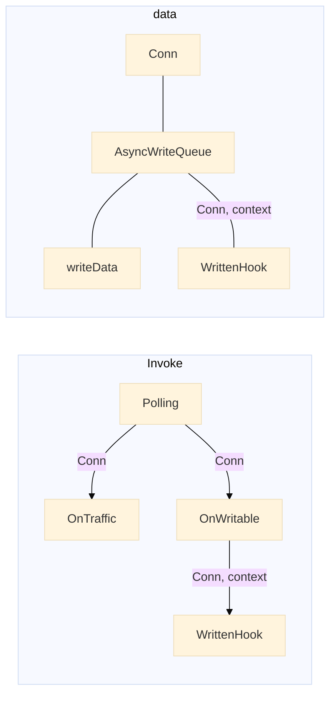

# 异步编程

## IO的阻塞/非阻塞/最小阻塞模式

`最小阻塞模式`: 
1. 仅依赖于内存与IO设备硬件传输数据的限制, 而不依赖任何其他的事件回调的IO模式. 
2. 在读/写后原缓存不再有保存数据的义务.
3. 最小阻塞模式可以最小化操作系统缓存的义务, 用户可完全掌控数据缓存.
最小阻塞在调用IO写数据时提供可写大小.
为什么读时不需要提供可读的必要信息呢? 因为调用读数据的条件是有空间可以读.

## 调用线程 -- go runtime/用户函数

### 调用起点 -- 事件

go runtime是最普遍性的调用线程, 但事件只能是操作系统定义的几种.
用户函数作为调用线程需要一个loop

## 调用程序体-go routine函数代码段/用户函数

代码段运行必然依赖信息, go routine代码段最大的优势在于存储该函数中的所有信息.

而用户函数的参数需要包括代码运行的所有信息.

闭包特性, 即使

## read和write的调用逻辑区别

### 事件条件

read: socket接受新数据
write: socket可写 && 用户自定条件

### 无阻塞的实践原则

尽可能少的利用函数堆栈存储数据
当函数语句依赖于两个及两个以上条件是抽象成函数, 而不是写在代码段里.

## 状态的维护职责

## IO链缓存/丢弃事件

## IO必要时间
